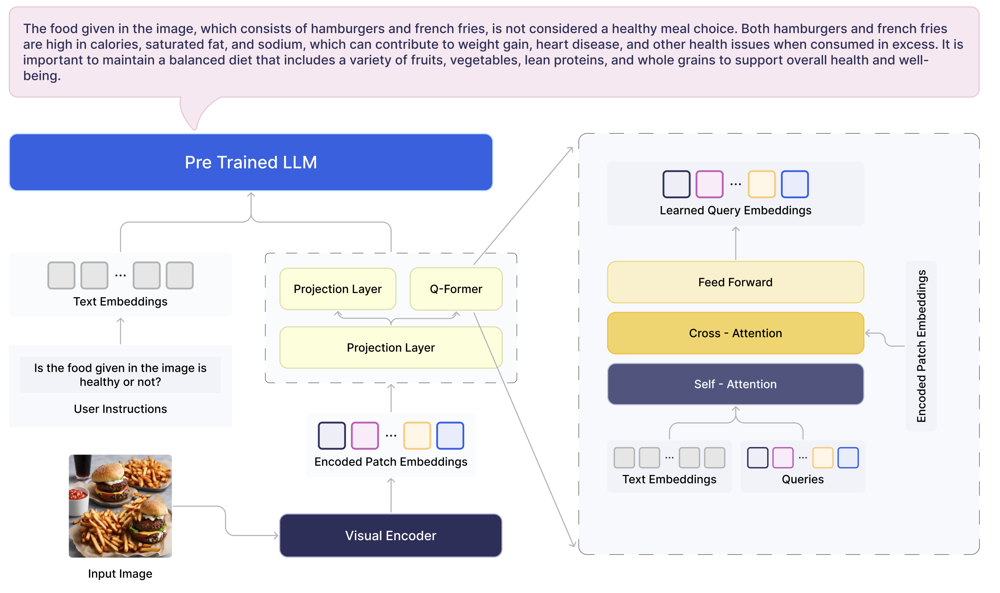

# Veagle: Advancement in Multimodal representation Learning
Rajat Chawla*, Arkajit Datta*, Tushar Verma, Adarsh Jha, Anmol Gautam, Ayush Vatsal, Sukrit Chatterjee, Mukunda NS and Ishaan Bhola. *Equal Contribution

**SuperAGI**

<a href='[https://arxiv.org/abs/2308.09936](https://arxiv.org/abs/2403.08773)'></a> <a href='https://huggingface.co/SuperAGI/Veagle'></a> 


<p align="center">
    <a href="https://huggingface.co/SuperAGI/Veagle"></a> <br> Model Architecture.
</p>

## Release
- [1/18] 🔥 We released the training code of Veagle. 
- [1/18] 🔥 We released **Veagle: Advancement in Multimodal representation Learning**.


## Installation

1. Clone the repository

```bash
git clone https://github.com/superagi/Veagle
cd Veagle
```

2. Run installation script 

```bash
source venv/bin/activate
chmod +x install.sh
./install.sh
```


## Inference 

```Shell
python evaluate.py --answer_qs \
        --model_name veagle_mistral \
        --img_path images/food.jpeg \
        --question "Is the food given in the image is healthy or not?"
```

```Shell
python evaluate.py --answer_qs \
        --model_name veagle_mistral \
        --img_path images/dog.jpeg \
        --question "Write a poem that rhymes very well based on the above image."
```

```Shell
python evaluate.py --answer_qs \
        --model_name veagle_mistral \
        --img_path images/astronaut.jpeg \
        --question "What is the significance of this moment in history?"
```

## Train

After downloading the training datasets and specify their path in [dataset configs](veagle/configs/datasets/), we are ready for training. We utilized 8x A100 SXM in our experiments. Please adjust hyperparamters according to your GPU resources in train config file. It may take transformers around 2 minutes to load the model, give some time for the model to start training. Make sure you have completed the installation procedure before you start training. Here we give an example of traning Veagle.

1. Pretraining of Veagle's visual assistant branch

```Shell
torchrun --nnodes=1 --nproc_per_node=8 \
    train.py \
    --cfg-path train_configs/pretrain_veagle_mistral.yaml
```

2. Instruction Finetuning Veagle

You can run Finetuning after you have completed pretraining. Make sure to provide the pretrained model's path in the finetuning config.

```Shell
torchrun --nnodes=1 --nproc_per_node=8 \
    train.py \
    --cfg-path train_configs/finetune_veagle_mistral.yaml
```


## Acknowledgement
- [BLIP2](https://huggingface.co/docs/transformers/main/model_doc/blip-2) The model architecture of BLIVA follows BLIP-2. Don't forget to check this great open-source work if you don't know it before. 
- [BLIVA](https://github.com/mlpc-ucsd/BLIVA) The code base we took inspiration from.
- [mPLUG-Owl2](https://github.com/X-PLUG/mPLUG-Owl) The code base we took inspiration from.

## License
This repository's code is under [BSD 3-Clause License](LICENSE.md).
Many codes are based on [BLIVA](https://github.com/mlpc-ucsd/BLIVA) and [mPLUG-Owl2](https://github.com/X-PLUG/mPLUG-Owl) with 
BSD 3-Clause License [here](LICENSE_LAVIS.md).

[](LICENSE.md)


